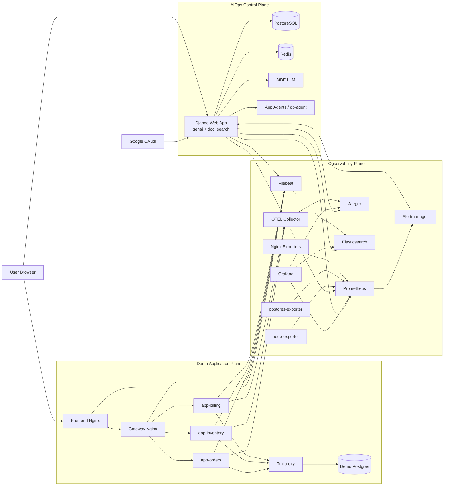

# AIOps Demo Architecture

This document explains the end-to-end architecture of the AIOps demo environment, including:

- user traffic flow
- demo app behavior
- observability flow
- dependency graph and blast radius
- prediction model and risk scoring
- alerting and AiDE recommendation flow
- remote command execution flow
- chaos injection flow

## Diagram Assets

Editable diagram sources are available here:

- `diagrams/aiops-architecture.mmd`
- `diagrams/aiops-architecture.drawio`

## Current Tech Stack

- UI: Django templates, HTML, CSS, JavaScript
- Backend: Django, Python
- Authentication: Google OAuth via `django-allauth`
- Data stores:
  - PostgreSQL for application data, incidents, predictions, and chat history
  - Redis for cache / ephemeral state
- LLM: AiDE
- Document search / RAG: `doc_search`
- Observability:
  - Prometheus
  - Alertmanager
  - Grafana
  - OpenTelemetry Collector
  - Jaeger
  - Elasticsearch
  - Filebeat
  - node-exporter
  - postgres-exporter
  - Nginx exporters
- Reverse proxy / application edge:
  - Nginx
- Demo services:
  - `frontend`
  - `gateway`
  - `app-orders`
  - `app-inventory`
  - `app-billing`
- Chaos engineering:
  - Toxiproxy
- Remote diagnostics:
  - app-local agent
  - `db-agent`
- Container orchestration:
  - Docker Compose

## 1. High-Level Architecture

```text
                        +---------------------------+
                        |        User Browser       |
                        |   http://localhost:8088   |
                        +-------------+-------------+
                                      |
                                      v
                        +---------------------------+
                        |      Frontend Nginx       |
                        |   demo/frontend/nginx     |
                        +-------------+-------------+
                                      |
                                      v
                        +---------------------------+
                        |      Gateway Nginx        |
                        |   demo/gateway/nginx      |
                        +------+------+------+------+
                               |      |      |
                               v      v      v
                      +-----------+ +-----------+ +-----------+
                      | orders_   | | inventory_| | billing_  |
                      | demo proxy| | demo proxy | | demo proxy|
                      +-----+-----+ +-----+-----+ +-----+-----+
                            |             |             |
                            v             v             v
                        +--------+   +--------+   +--------+
                        | Orders |   |Inventory|   |Billing |
                        |  App   |   |  App    |   |  App   |
                        +----+---+   +----+----+   +----+---+
                             \          |           /
                              \         |          /
                               \        |         /
                                v       v        v
                           +--------------------+
                           |     Toxiproxy      |
                           |   DB Fault Layer   |
                           +---------+----------+
                                     |
                                     v
                           +--------------------+
                           |      Postgres      |
                           +--------------------+
```

## 1A. Mermaid Architecture



## 2. Demo App Behavior

The demo application is intentionally small but realistic enough to show shared-failure propagation.

### Services

- `frontend`
  Serves the browser UI and proxies `/api/*` calls to the internal gateway.
- `gateway`
  Routes requests to the three backend services and records Nginx access/error logs.
- `app-orders`
  Handles order reads and order creation.
- `app-inventory`
  Handles inventory reads and stock reservation.
- `app-billing`
  Handles billing reads and charge authorization.
- `db`
  Shared Postgres dependency for all three apps.

### Backend app endpoints

Each backend app exposes:

- `/query`
  Reads service data from Postgres.
- `/write`
  Executes a service-specific write flow.
- `/metrics`
  Exposes Prometheus metrics.
- `/health`
  Health endpoint.
- embedded agent on port `9999`
  Runs allowlisted diagnostic commands inside the same app container.

### What the write flow does

The UI `Run Checkout` action triggers three sequential API calls:

```text
1. POST /api/orders/create
2. POST /api/inventory/reserve
3. POST /api/billing/charge
```

Those map to:

- orders app:
  inserts into `demo_orders`
- inventory app:
  updates or reserves stock in `demo_inventory`
- billing app:
  writes a billing event to `demo_billing`

### Why this structure matters

This gives you both:

- healthy reads and writes
- shared downstream dependency impact
- single-service failure impact
- network chokepoint impact at the gateway layer

## 3. Observability Architecture

```text
  Demo Apps ---------------------> OTEL Collector -----------------> Jaeger
      |                                  |
      |                                  +-----------------------> Prometheus
      |
      +----> Prometheus /metrics

  Frontend Nginx ----> Nginx Exporter ---+
                                         |
  Gateway Nginx -----> Nginx Exporter ---+-----------------------> Prometheus

  Postgres Exporter ---------------------------------------------> Prometheus
  Node Exporter -------------------------------------------------> Prometheus

  Django AIOps logs ---> Filebeat ---> Elasticsearch
  Demo app logs -------> Filebeat ---> Elasticsearch
  Nginx logs ----------> Filebeat ---> Elasticsearch
```

## 4. AIOps Control Plane

```text
             +---------------------------+
             |       Prometheus          |
             |   evaluates alert rules   |
             +-------------+-------------+
                           |
                           v
             +---------------------------+
             |       Alertmanager        |
             |  webhook -> Django AIOps  |
             +-------------+-------------+
                           |
                           v
             +---------------------------+
             |     Django AIOps App      |
             |  /genai/alerts/ingest/    |
             +-------------+-------------+
                           |
       +-------------------+-------------------+
       |                   |                   |
       v                   v                   v
  Prometheus API     Elasticsearch API     Jaeger API
  metrics/context         logs             traces/context
       \                   |                   /
        \                  |                  /
         +-----------------+-----------------+
                           |
                           v
             +---------------------------+
             |      AiDE LLM API         |
             | diagnosis/recommendation  |
             +-------------+-------------+
                           |
                           v
             +---------------------------+
             | Prediction Engine         |
             | risk score / next 15m     |
             +-------------+-------------+
                           |
                           v
             +---------------------------+
             | Recent Recommendations    |
             | /genai/alerts/recent/     |
             | /genai/alerts/dashboard/  |
             +-------------+-------------+
                           |
                           v
             +---------------------------+
             | Optional command run      |
             | /genai/execute_command/   |
             +-------------+-------------+
                           |
                           v
             +---------------------------+
             |  Remote Agent on server   |
             |   allowlisted commands    |
             +---------------------------+
```

## 5. Dependency Graph And Blast Radius

The current service dependency graph is static.

Source:

- `demo/dependencies/application_graph.json`

This graph is used for:

- dependency display in the portfolio dashboard
- blast-radius calculation
- alert context enrichment
- prediction features
- AiDE reasoning context

### Example graph for `customer-portal`

```text
frontend -> gateway
gateway -> app-orders, app-inventory, app-billing
app-orders -> db
app-inventory -> db
app-billing -> db
```

### How blast radius is calculated

For a selected failing service:

1. Load the application graph.
2. Find direct downstream dependencies.
3. Build the reverse graph.
4. Walk the reverse graph to find transitive dependents.
5. Return:
   - `depends_on`
   - `direct_dependents`
   - `blast_radius`
   - `dependency_chain`

Example:

```text
Failing service: db
Direct dependents: app-orders, app-inventory, app-billing
Blast radius: app-orders, app-inventory, app-billing, gateway, frontend
```

Important note:

- the current graph is hardcoded for determinism in the demo
- it is not auto-discovered yet
- later it can be replaced or augmented by a trace-derived graph

## 6. User Traffic Flow

### Read Flow

```text
Browser
  -> Frontend Nginx
  -> Gateway Nginx
  -> /query on Orders / Inventory / Billing app
  -> Postgres via Toxiproxy
  -> JSON response back to browser
```

What this demonstrates:

- frontend depends on gateway
- gateway depends on backend apps
- backend apps depend on database
- if database slows down, the customer-facing UI slows down

### Write Flow

The `Run Checkout` button triggers a chained transaction:

```text
1. POST /api/orders/create
2. POST /api/inventory/reserve
3. POST /api/billing/charge
```

Each call goes through:

```text
Browser
  -> Frontend Nginx
  -> Gateway Nginx
  -> target app /write
  -> Postgres via Toxiproxy
```

The data persisted in Postgres includes:

- `demo_orders`
- `demo_inventory`
- `demo_billing`
- `demo_service_state`

This gives both:

- healthy user transaction scenario
- failed/degraded user transaction scenario

## 7. Prediction Model

Prediction v1 uses a tabular model, not an LLM.

### What is being predicted

The percentage shown in the application portfolio dashboard means:

```text
Probability that a service or application will enter an incident or degraded state
within the next 15 minutes
```

Examples:

- `3%`
  very low near-term incident risk
- `48%`
  medium near-term incident risk
- `82%`
  high likelihood of degradation or alerting in the next 15 minutes

### Where the score appears

On:

- `/genai/applications/dashboard/`

The dashboard now shows:

- `Predicted incident risk next 15m: <score>%`

And per component hover cards show:

- `high / medium / low incident risk`
- the prediction percentage
- the prediction window
- a short explanation

### Model strategy

Prediction v1 prefers:

- `XGBoost`

Fallbacks:

- `RandomForestClassifier`
- heuristic scoring if no trained model artifact exists yet

### Features used

Current feature set:

- `up`
- `request_rate`
- `latency_p95_seconds`
- `error_rate`
- `dependency_count`
- `dependent_count`
- `blast_radius_size`
- `active_alert_count`

### Data storage

Prediction data is stored in Django models:

- `PredictionSnapshot`
  historical feature snapshots
- `ServicePrediction`
  scored predictions and explanations

### Training flow

1. Capture snapshots periodically.
2. Store labels based on current degraded/down state or active alerts.
3. Train a model using historical snapshots.
4. Save the trained artifact.
5. Use the model for inference in the prediction loop.

### Runtime components

- `genai/predictions.py`
  feature building, training, and inference
- `predictor` Docker service
  continuously captures snapshots and writes predictions
- management commands
  - `capture_prediction_snapshot`
  - `train_prediction_model`
  - `run_prediction_loop`

### Important distinction

- Prediction is done by the ML/statistical model.
- AiDE is used for explanation, recommendations, and contextual reasoning.
- AiDE is not used as the core prediction engine.

## 8. Alerting and Recommendation Flow

### Step-by-step

```text
1. Prometheus scrapes metrics from:
   - demo apps
   - Nginx exporters
   - postgres-exporter
   - node-exporter
   - OTEL Collector

2. Prometheus evaluates alert rules in:
   demo/alerts/demo-rules.yml

3. Alertmanager receives firing alerts.

4. Alertmanager sends webhook payload to:
   http://web:8000/genai/alerts/ingest/

5. Django AIOps normalizes the Alertmanager payload.

6. Django AIOps collects context from:
   - Prometheus
   - Elasticsearch
   - Jaeger

7. Django AIOps sends that context to AiDE.

8. AiDE returns:
   - summary
   - likely cause
   - target host
   - diagnostic command
   - should_execute flag

9. Django AIOps stores the recommendation.

10. The recommendation becomes visible at:
    - /genai/alerts/recent/
    - /genai/alerts/dashboard/
```

### Alert types currently configured

- `DemoAppLatencyHigh`
  p95 latency is high on a backend app
- `DemoAppErrorsHigh`
  backend app is returning elevated 5xx
- `DemoDatabaseConnectionsHigh`
  Postgres active sessions are high
- `DemoServiceDown`
  one backend app target is down
- `DemoDatabaseDown`
  postgres-exporter or DB reachability is down
- `DemoGatewayUnavailable`
  internal gateway Nginx/exporter is unavailable
- `DemoFrontendUnavailable`
  frontend Nginx/exporter is unavailable

Important point:

- AiDE does not directly connect to Prometheus, Jaeger, or Elasticsearch.
- Django AIOps fetches telemetry first and sends the context to AiDE.

That means:

- credentials remain in the app
- telemetry access is controlled
- AiDE acts as reasoning engine, not unrestricted tool client

## 9. Alerting and Recommendation Flow Details

The alert flow now includes dependency context.

When an alert is ingested:

1. AIOps gathers:
   - Prometheus metrics
   - Elasticsearch logs
   - Jaeger traces
   - dependency graph context
2. It passes all of that to AiDE.
3. AiDE can reason not only about root cause, but also:
   - likely impacted services
   - blast radius
   - shared dependency impact

The cached alert recommendation now stores:

- `depends_on`
- `blast_radius`
- `dependency_graph`

These fields are displayed in:

- `/genai/alerts/dashboard/`

## 10. Remote Command Execution Flow

This is the operator-assisted or demo-action path.

```text
Alert Recommendation Dashboard
  -> Run In App Container button
  -> POST /genai/execute_command/
  -> Django AIOps
  -> embedded agent in target app container
  -> command output returned
  -> AiDE analyzes output
  -> result stored back into recommendation
```

### Security model in this demo

The embedded agent only runs allowlisted commands from:

- `demo/app/allowed_commands.json`

Examples:

- `df -h`
- `free -m`
- `top -b -n 1`
- `systemctl status ...`
- `journalctl -u ...`
- `ss -tulpn`

This is a demo-safe model:

- AiDE suggests
- app delegates
- agent restricts what can run

## 11. Chaos Injection Architecture

The fault layer is Toxiproxy. It is used in two places.

```text
App containers
   -> toxiproxy:15432
   -> db:5432
```

```text
Gateway Nginx
   -> toxiproxy:18001 -> app-orders:8000
   -> toxiproxy:18002 -> app-inventory:8000
   -> toxiproxy:18003 -> app-billing:8000
```

This allows:

- database-path faults
- gateway-to-app network faults
- repeatable failures without changing application code

### Chaos scripts

#### `configure-toxiproxy.sh`

Creates:

```text
postgres_demo:
  listen   = 0.0.0.0:15432
  upstream = db:5432

orders_demo:
  listen   = 0.0.0.0:18001
  upstream = app-orders:8000

inventory_demo:
  listen   = 0.0.0.0:18002
  upstream = app-inventory:8000

billing_demo:
  listen   = 0.0.0.0:18003
  upstream = app-billing:8000
```

#### `set-db-latency.sh`

Adds latency to the DB path:

```text
App -> Toxiproxy -(delay)-> Postgres
```

Use:

```bash
sh set-db-latency.sh 3000 250
```

Meaning:

- add about 3000 ms latency
- jitter about 250 ms

Expected result:

- app DB queries slow down
- gateway upstream time increases
- frontend becomes slow
- alerts eventually fire

#### `cut-db-traffic.sh`

Adds a timeout toxic:

```text
App -> Toxiproxy -(timeout)-> Postgres
```

Expected result:

- database calls fail or time out
- apps return 5xx
- frontend errors become visible

#### `reset-db-proxy.sh`

Removes active toxics and returns the path to healthy state.

#### `set-gateway-latency.sh`

Adds latency between gateway and one or more backend apps:

```text
Gateway -> Toxiproxy -(delay)-> App
```

Use:

```bash
sh set-gateway-latency.sh all 2000 250
```

Expected result:

- frontend slows down
- gateway remains reachable
- app processes may still look healthy internally
- this produces a different signature from DB latency

#### `cut-gateway-traffic.sh`

Adds a timeout toxic on the gateway-to-app path.

Expected result:

- gateway starts failing selected routes
- frontend shows partial or full failure
- backend app may still be healthy when checked directly

#### `reset-gateway-proxy.sh`

Removes gateway-to-app toxics and restores healthy routing.

#### `stop-demo-service.sh` / `start-demo-service.sh`

These scripts stop or start selected services:

- `db`
- `gateway`
- `app-orders`
- `app-inventory`
- `app-billing`

This is useful for clean `service down` alert demonstrations.

#### `run-demo-traffic.sh`

Generates continuous workload:

- `read` mode
- `write` mode
- `mixed` mode

This is useful because alerts need active traffic to produce measurable symptoms.

## 12. End-to-End Demo Sequence

### Healthy Scenario

```text
1. Start the stack.
2. Open frontend demo at localhost:8088.
3. Use Refresh Dashboard.
4. Use Run Checkout.
5. Observe:
   - requests succeed
   - data is read/written in Postgres
   - metrics/traces/logs are generated
```

### Degraded Scenario

```text
1. Start traffic:
   sh run-demo-traffic.sh mixed

2. Inject DB latency:
   sh set-db-latency.sh 3000 250

3. Observe:
   - frontend latency rises
   - checkout slows or fails
   - app errors/timeouts increase
   - Prometheus alert enters pending/firing
   - Alertmanager sends webhook to AIOps
   - AIOps collects telemetry context
   - AiDE returns diagnosis/recommendation
   - recommendation appears in alerts dashboard
```

### Other Failure Scenarios

#### Shared dependency failure: DB down

```text
1. sh stop-demo-service.sh db
2. all three backend apps begin to fail on DB-backed endpoints
3. frontend shows broad impact
4. DemoDatabaseDown and app error alerts fire
```

#### Shared network chokepoint: gateway to app latency

```text
1. sh set-gateway-latency.sh all 2000 250
2. frontend slows down
3. gateway is still up, but app routes are delayed
4. app resource usage may still look normal
5. latency alerts fire with a different evidence pattern from DB issues
```

#### Single-service failure

```text
1. sh stop-demo-service.sh app-orders
2. only the orders panel and orders write step fail
3. inventory and billing can remain healthy
4. DemoServiceDown fires for app-orders
```

### Operator Action Scenario

```text
1. Open /genai/alerts/dashboard/
2. Review recommendation
3. If enabled, click Run In App Container
4. Django AIOps sends command to remote agent
5. Agent returns output
6. AiDE analyzes the result
7. Dashboard updates with final answer
```

## 13. Main URLs

### User-facing

- Frontend demo: `http://localhost:8088`
- AIOps widget: `http://localhost:8000/genai/widget/`
- AIOps alert dashboard: `http://localhost:8000/genai/alerts/dashboard/`
- AIOps application portfolio: `http://localhost:8000/genai/applications/dashboard/`
- AIOps predictions API: `http://localhost:8000/genai/predictions/recent/`
- AIOps document console: `http://localhost:8000/genai/console/`

### Observability

- Prometheus: `http://localhost:9090`
- Alertmanager: `http://localhost:9093`
- Grafana: `http://localhost:3000`
- Jaeger: `http://localhost:16686`
- Elasticsearch: `http://localhost:9200`

### APIs

- Alert ingest: `http://localhost:8000/genai/alerts/ingest/`
- Recent recommendations: `http://localhost:8000/genai/alerts/recent/`
- Execute command: `http://localhost:8000/genai/execute_command/`

## 14. Key Design Decisions

### Why separate frontend and gateway Nginx?

To make dependency propagation easier to demonstrate:

- frontend = user-facing web tier
- gateway = internal API tier

This makes it easier to show:

```text
DB issue
  -> app issue
  -> gateway upstream slowdown
  -> frontend customer impact
```

It also lets you demonstrate gateway-path failures separately from DB failures.

### Why AiDE does not connect directly to monitoring systems

Because the app should control:

- authentication
- available tools
- prompt shape
- telemetry selection

So the design is:

```text
App fetches telemetry -> AiDE reasons on context -> App decides next action
```

### Why Toxiproxy?

Because it gives:

- deterministic failure injection
- repeatable demos
- clean recovery
- no code changes in app services

Using Toxiproxy on both paths means you can show:

- shared downstream dependency issues
- network transport issues
- partial service isolation failures

### Why the dependency graph is static right now

Because for the demo it gives:

- deterministic blast radius
- easy-to-explain impact chains
- no dependence on trace quality

This can later evolve to:

- static baseline graph
- plus dynamic observed graph from traces

### Why the prediction model is not an LLM

Because incident prediction is a tabular/time-series problem.

So:

- ML model predicts risk
- AiDE explains and recommends actions

This is cheaper, more stable, and more appropriate than calling the LLM continuously for prediction.

## 15. Current Demo Scope

Implemented:

- multi-tier app path
- DB-backed read and write flows
- metrics, logs, traces
- Prometheus alerting
- Alertmanager webhook to AIOps
- AiDE recommendation generation
- in-container command execution dashboard
- DB-path chaos injection
- gateway-to-app chaos injection
- service stop/start chaos scenarios
- static dependency graph and blast radius calculation
- prediction snapshots and service risk scoring
- portfolio dashboard with application-level prediction display

Not yet expanded:

- more application services
- more realistic cross-service dependencies
- dynamic service graph discovery from traces
- mature trained prediction model from larger history
- full production policy and approval engine
- durable incident history models
